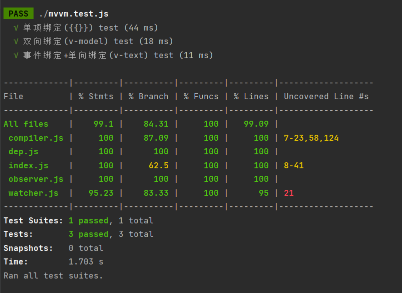

# MVVM框架

### 个人信息

- 姓名：刘屿

- 院校：南京大学

- 专业：软件工程

- 年级：20级

- 学号：201250141

### 基本功能
示例见index.html

- **v-model**
  
  - 双向绑定
  
  - 语法格式
    
    ```javascript
    v-model="attr"
    //自动把输入值赋值给mvvm实例的attr属性。
    ```

- **v-text**
  
  - 单向绑定
  
  - 语法格式
    
    ```javascript
    v-text="attr"
    //将mvvm实例的attr属性值填充到标签中。
    ```

- **事件绑定**
  
  - 语法格式：@
  
  - 例如：
    
    ```html
    <button @click="handleClick">number++</button>
    ```

- **{{}}**

  - 单向绑定

  - 语法格式

    ```javascript
    {{message}}
    //直接将message的值填充进去
    ```

### 使用示例

```html
<div id="app">
  <strong>case 1: v-model 双向绑定</strong><br>
  <input type="text" v-model="message">
  <p>message: {{message}}</p>

  <strong>case 2: v-text 单向绑定</strong>
  <p v-text="message"></p>

  <strong>case 3: \{\{'message: ' + message}} 单向绑定</strong><br>
  <p>{{'message: ' + message}}</p>

  <strong>case 4: \{\{info.a}} 单向绑定 可以通过控制台vm.info.a来改变</strong><br>
  <p>info.a: {{info.a}}</p>

  <strong>case 5: 事件绑定</strong><br>
  <p>number: {{number}}</p>
  <button @click="handleClick">number++</button>
</div>
<script>
  let vm = new MVVM({
    el: '#app',
    data: {
      message: 'hello world',
      number: 0,
      info: {
        a: 'this is info.a'
      }
    },
    methods: {
      handleClick: function () {
        this.number++;
      }
    }
  });
</script>
```

### 单元测试

- jest



#### 具体代码

- mvvm.test.js

```javascript
import MVVM from "./src";
function renderHtml() {
    const div = document.createElement('div');
    div.setAttribute("id", "app");
    div.innerHTML = `
        <input type="text" v-model="message">
        <p>{{message}}</p>
        <h1 v-text="number"></h1>
        <button @click="handleClick">number++</button>
    `;
    document.body.appendChild(div);

    let vm = new MVVM({
        el: '#app',
        data: {
            message: 'hello world',
            number: 0
        },
        methods: {
            handleClick: function () {
                this.number++;
            }
        }
    });
    return vm;
}

test('单项绑定({{}}) test', () => {
   let vm = renderHtml();
   vm.$data.message = "message";
   expect(document.querySelector('p').innerHTML).toBe('message');
});

test('双向绑定(v-model) test', () => {
    renderHtml();
    let input = document.querySelector('input');
    input.value = "message";
    let evt = document.createEvent('HTMLEvents');
    evt.initEvent('input', true, true);
    input.dispatchEvent(evt);
    expect(document.querySelector('p').innerHTML).toBe('message');
});

test('事件绑定+单向绑定(v-text) test', () => {
    renderHtml();
    let button = document.querySelector('button');
    button.click();
    expect(document.querySelector('h1').innerHTML).toBe('1');
});
```

